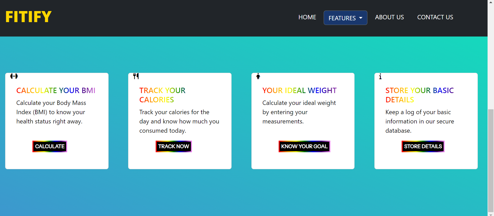

# 🚀 NutriGuide - Fitness Tracking Website 🚀

NutriGuide is a fitness tracking website built using HTML, CSS, Javascript. It provides various features for calculating, tracking and managing your fitness-related information. It is designed to help you in your fitness journey by providing powerful tools to track your progress. 

## Table of Contents
- [Screenshorts](#screenshorts)
- [Features](#features)
- [Built With](#built-with)
- [Links](#links)

## Screenshorts

## Features

The website includes the following features:

- **BMI Calculator**: Calculate your Body Mass Index (BMI) based on your height and weight.
- **Calorie Calculator**: Calculate your calorie intake and other nutritional data by tracking your meals.
- **Ideal Weight Calculation**: Calculate your ideal weight based on your height and bmi.
- **Recipe Finder**: Find delicious recipes to satisfy your cravings.
- **User Data Storage**: Store and manage user data using phpmyadmin.

## Built With

- HTML
- CSS
- Bootstrap
- JavaScript

## Links

- Live Site: [Click Here]
- Source Code Repo: [Click Here]